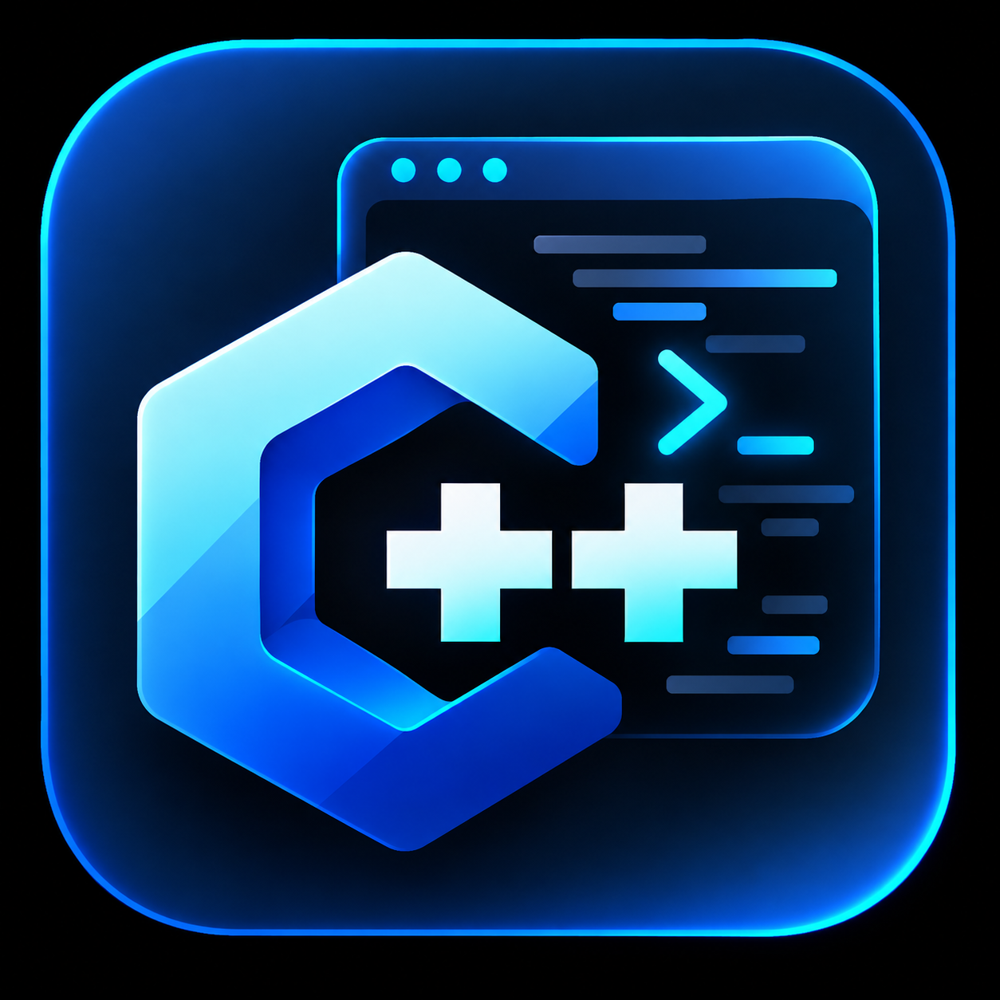

<div align="center">



# DroidCompiler

### A self-contained C/C++ IDE and native compiler for Android

Build, run, manage, and package native C/C++ projects directly on an Android device.

[](LICENSE)


**DroidCompiler is designed to make native Android development possible directly on Android, without requiring a desktop compiler for day-to-day C/C++ work.**

</div>

---

## Overview

DroidCompiler is an Android C/C++ development environment with an embedded Clang/LLD toolchain. It can edit, compile, link, and run native projects directly on-device, including console applications and SDL2/OpenGL ES projects.

The project also includes workspace management, a tree-based file explorer, build configuration, optional native libraries, Android/JNI integration, runtime logging, and an integrated APK export pipeline.

The goal is simple: provide a practical, open-source native development environment that can live entirely on an Android device.

---

## Features

### Editor and workspace

- C/C++ source editor with line numbers and lightweight syntax highlighting.
- Multiple open-file tabs.
- Active-line highlighting and adjustable editor font size.
- Local project workspaces.
- Android Storage Access Framework support for linked external folders.
- Project state isolated under `.droidx/` without taking ownership of a project's normal `build/` directory.

### File explorer

- Tree-based project explorer.
- Expandable and collapsible directories.
- Active-file highlighting.
- File filtering by name/path.
- Create files and folders.
- Import files into the project.
- Rename and delete files or directories.
- Context actions for files and folders.
- Common IDE/internal directories such as `.git`, `.gradle`, `.idea`, `.cxx`, and `.droidx` are hidden from the normal tree.

### Native compilation

- Embedded **Clang** compiler.
- Embedded **LLD** linker.
- C and C++ project support.
- `arm64-v8a` and `x86_64` compiler targets.
- Internal build pipeline without requiring GNU Make for supported project layouts.
- Compatibility layer for C4droid-style Makefile projects.
- Debug/release-oriented build settings.
- Configurable C++ standard, defines, include paths, compiler flags, linker flags, and libraries.

### Native libraries and graphics

DroidCompiler includes or can manage development/runtime support for:

- SDL2
- OpenGL ES / EGL
- zlib
- zstd
- SQLite
- libcurl
- OpenSSL
- libpng
- libjpeg-turbo

> Availability for compilation/runtime and availability inside an **exported APK** are separate concerns. See [APK export limitations](#apk-export-limitations).

### Running applications

- Native console runner.
- SDL2/OpenGL ES runner.
- Separate runner processes for better IDE isolation.
- Foreground execution support for user-started long-running native programs.
- Build and runtime log.
- Compact output panel inside the editor UI.
- Stop controls for active programs.

### Android integration

Native projects can integrate with Android through DroidCompiler's host bridge, including support for functionality such as:

- JNI environment access.
- Android logging.
- Notifications.
- Wake locks.
- Opening URLs.
- Foreground execution support.

---

## APK export

DroidCompiler contains an integrated APK export pipeline. The exporter can take the currently built native project and package it into a standalone Android APK without installing a second packager application.

The export flow can handle:

- App name and package ID.
- Version name and version code.
- Custom application icon.
- Orientation settings.
- Project assets.
- Native `libprogram.so` packaging.
- SDL2 and runner bridge packaging when required.
- `libc++_shared.so` when required.
- 16 KiB-aligned native library entries.
- APK signing and verification.
- Install, save, and share flows.

The export runtime is generated at DroidCompiler build time and embedded into the main application as an internal template.

### APK export limitations

The current exporter intentionally blocks projects whose `libprogram.so` dynamically depends on optional runtimes such as:

- libcurl
- OpenSSL
- zstd
- SQLite
- libpng
- libjpeg

These libraries can be useful inside DroidCompiler during development, but their full transitive runtime dependency closure is not yet bundled into exported APKs.

Other current limitations:

- The bundled APK signing key is intended for development builds.
- Importing a custom release keystore is not implemented yet.
- Arbitrary manifest permission injection is not implemented yet.
- Custom project Java/Kotlin source is not currently compiled into exported APKs.
- Export targets the ABI used for the current build/device; universal multi-ABI APK export is not implemented yet.

---

## How the architecture works

```text
                     DroidCompiler
                          |
          +---------------+---------------+
          |                               |
      Project UI                    Build settings
          |                               |
          +---------------+---------------+
                          |
                    ProjectStore
                          |
                Private workspace mirror
                          |
                .droidx/build/ state
                          |
                   Clang + LLD
                          |
                    libprogram.so
                     /          \
                    /            \
            Console runner     SDL runner
                                     |
                                SDL2 / GLES

                          |
                          +----> APK exporter
                                  |
                         Embedded APK template
                                  |
                         Signed standalone APK
```

External Storage Access Framework projects are mirrored into an app-private workspace for native compilation because `content://` document trees do not provide stable native filesystem paths.

See [`ARCHITECTURE.md`](ARCHITECTURE.md) for more detail.

---

## Repository structure

```text
DroidCompiler/
├── app/
│   ├── src/main/java/com/droidx/   # IDE, compiler, runner and exporter
│   ├── src/main/cpp/               # Native runner bridge
│   └── src/main/res/               # Android resources and app icon
│
├── buildSrc/
│   └── src/main/...                # Build-time embedding helpers
│
├── export-runtime/
│   └── src/main/                   # Runtime used to generate APK template
│
├── gradle/                         # Gradle wrapper configuration
├── ARCHITECTURE.md
├── APK_EXPORT.md
├── build.gradle
├── settings.gradle
└── README.md
```

`export-runtime/` is **build input**, not a second installable Android application module.

---

## Requirements

### To build DroidCompiler itself

- Android Studio with JDK 17 support.
- Android Gradle Plugin **8.5.2**.
- Gradle **8.11.1** configuration.
- Android SDK Platform **34** for the main application.
- Android SDK Platform **36** is also required by the integrated APK-template generation step.
- Android NDK installed through Android Studio's SDK Manager, or an explicit `droidxNdkDir` configuration.

Current Android application SDK configuration:

```gradle
compileSdk 34
minSdk 34
targetSdk 36
```

Supported embedded compiler ABIs:

```text
arm64-v8a
x86_64
```

---

## Building the project

### Android Studio

1. Clone the repository:

```bash
git clone https://github.com/YOUR_USERNAME/DroidCompiler.git
cd DroidCompiler
```

2. Open the root directory in Android Studio.
3. Make sure Android SDK Platforms 34 and 36 and an Android NDK are installed.
4. Let Gradle sync the project.
5. Build and install the `app` module.

If your NDK is installed outside the standard SDK locations, set it explicitly:

```properties
droidxNdkDir=/path/to/android-ndk
```

The build process prepares the embedded compiler toolchain, SDL2 files, Android graphics headers, and the integrated APK export runtime automatically.

---

## Using DroidCompiler

A typical workflow is:

1. Open or create a project.
2. Browse the project from the file explorer.
3. Open and edit C/C++ source files.
4. Configure compiler/linker settings if required.
5. Tap **Build**.
6. Tap **Run** to execute the native application.
7. Inspect **Output** or **Full Log** if needed.
8. For compatible projects, use **Export APK** to create a standalone Android application.

---

## Project data

DroidCompiler reserves the following project-local directory for its own generated state:

```text
.droidx/
```

For example:

```text
.droidx/
├── build/        # Objects, fingerprints and libprogram.so
└── export/       # APK export metadata and custom icon
```

A project's own `build/` directory remains normal user/project content.

---

## Project status

DroidCompiler is an active independent project. The core workflow is already functional, but there is still room to improve areas such as:

- Code completion and richer language intelligence.
- Project-wide search/replace.
- Release keystore management.
- Exporting APKs with optional dynamic runtime dependencies.
- Universal / multi-ABI APK export.
- More advanced Android project integration.
- Additional debugging and developer tooling.

Contributions in these areas are welcome.

---

## Contributing

Contributions are welcome, whether they are bug fixes, UI improvements, documentation, compiler compatibility changes, new library integrations, or larger features.

A good contribution workflow is:

1. Fork the repository.
2. Create a feature branch.
3. Keep changes focused and avoid unrelated generated files.
4. Test both the IDE build and the affected native workflow.
5. Open a pull request describing what changed and how it was tested.

For larger architectural changes, opening an issue first is recommended so the implementation can be discussed before significant work is done.

---

## Why open source?

DroidCompiler is being released openly because an on-device native development environment can be useful well beyond a single project.

If the code helps someone learn C++, prototype on Android, build tools without a desktop machine, experiment with SDL/OpenGL, or create something new, then making the project available has done its job.

You are free to use it, study it, modify it, and build on it under the terms of the MIT License.

---

## License

DroidCompiler is released under the **MIT License**.

You may use, copy, modify, merge, publish, distribute, sublicense, and/or sell copies of the software, subject to the terms of the license.

See [`LICENSE`](LICENSE) for the full license text.

---

## Disclaimer

DroidCompiler executes and packages native code supplied by the user. Review code and third-party dependencies before compiling or running them. Android platform behavior, permissions, SDK/NDK compatibility, and third-party native libraries may change over time.

---

<div align="center">

**Built for native development directly on Android.**

If DroidCompiler is useful to you, consider starring the repository or contributing back to the project.

</div>
